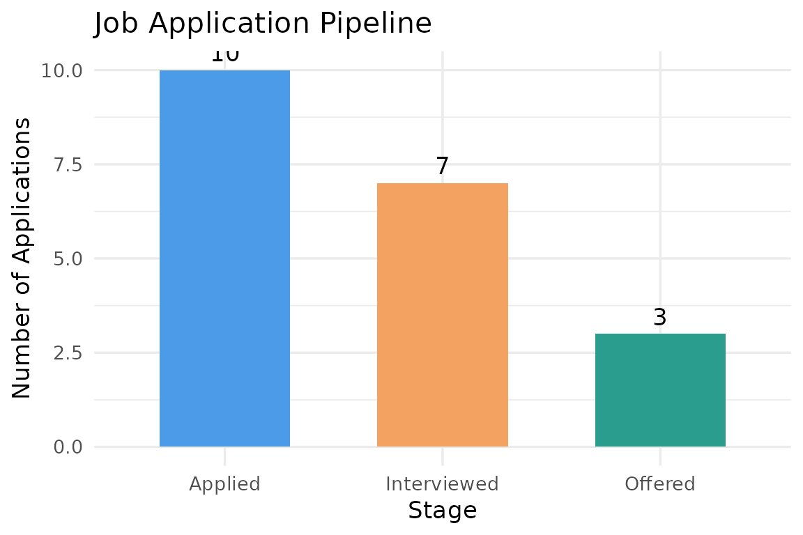

# Introduction to jobtrackr

## The Problem With Job Hunting

It is the spring semester of your senior year. You have been applying to
jobs for weeks, in the current job market, some on LinkedIn, some
through referrals, some on Indeed. Your spreadsheet is a mess. You
cannot remember which companies responded, which ones ghosted you, or
whether that offer from NYC is actually better than the one from
Wisconsin once you factor in the cost of living.

jobtrackr was built to solve that problem. It is a small R package that
helps you track, organize, and analyze your job applications. It will
not find you a job, but it will help you have a clearer vision about the
ones you have already applied for.

## Getting Started

First, load the package and the built-in example dataset. The `jobs`
dataset contains 30 simulated job applications across different
companies, locations, and statuses. Which I think is sort of realistic
of what a semester of job hunting looks like.

``` r

library(jobtrackr)
data(jobs)
```

Let us take a quick look at what the data contains:

``` r

head(jobs)
```

    ##     company         position         location cost_of_living      status
    ## 1    Google     Data Analyst      New York NY            100 Interviewed
    ## 2    Amazon   HR Coordinator        Austin TX             82    Rejected
    ## 3  Deloitte Business Analyst       Chicago IL             88     Applied
    ## 4 Microsoft   Data Scientist       Seattle WA             91     Offered
    ## 5     Apple Jr. Statistician San Francisco CA            110    Rejected
    ## 6       IBM    Data Engineer        Austin TX             82 Interviewed
    ##   date_applied salary      source
    ## 1   2024-01-10  95000    LinkedIn
    ## 2   2024-01-15  85000    Referral
    ## 3   2024-01-20  78000      Indeed
    ## 4   2024-02-01 110000    LinkedIn
    ## 5   2024-02-05  88000 Career Fair
    ## 6   2024-02-10  82000      Indeed

Each row is one application. The columns tell us the company, position,
location, cost of living index for that city, current status, date
applied, estimated salary, and where the listing was found.

## Step 1: Where Do Things Stand?

The first thing any job seeker wants to know is simple: out of
everything I applied to, what actually happened?

[`application_summary()`](https://adc-405-s26.github.io/jobtrackeR/reference/application_summary.md)
answers that question in one line.

``` r

application_summary(jobs)
```

    ## Response rate (non-Applied): 66.7%

    ##        status count percent
    ## 1     Applied    10    33.3
    ## 2    Rejected    10    33.3
    ## 3 Interviewed     7    23.3
    ## 4     Offered     3    10.0

Out of 30 applications, exactly one third are still sitting at “Applied”
with no response, and another third ended in rejection. Only 3
applications (10%) resulted in an offer. The overall response rate is
66.7%, meaning roughly 2 out of every 3 applications received some kind
of reply. This kind of summary helps you quickly understand where your
job search stands without scrolling through a spreadsheet.

## Step 2: Who Has Not Responded Yet?

Waiting is the hardest part of job hunting. But there is a difference
between patiently waiting and being ghosted.
[`days_since_applied()`](https://adc-405-s26.github.io/jobtrackeR/reference/days_since_applied.md)
calculates how many days have passed since each application was
submitted, and flags any that have gone more than 21 days with no
response.

``` r

result <- days_since_applied(jobs, flag_after = 21)
result[result$possibly_ghosted == TRUE,
       c("company", "position", "date_applied", "days_waiting")]
```

    ##       company             position date_applied days_waiting
    ## 3    Deloitte     Business Analyst   2024-01-20          858
    ## 7        Meta      Product Analyst   2024-02-15          832
    ## 10 Salesforce           BI Analyst   2024-03-05          813
    ## 13     Target Supply Chain Analyst   2024-03-12          806
    ## 17        PWC      Audit Associate   2024-03-22          796
    ## 19     Boeing         Data Analyst   2024-03-28          790
    ## 22       KPMG     Advisory Analyst   2024-04-05          782
    ## 25    Spotify         Data Analyst   2024-04-12          775
    ## 27   LinkedIn            Recruiter   2024-04-17          770
    ## 30       Zoom     Customer Success   2024-04-25          762

Ten applications have gone over 21 days with no response and are flagged
as possibly ghosted. Companies like Deloitte, Meta, and Salesforce have
been waiting the longest, of over 800 days in this simulated dataset. In
a real job search, I think this is helpful because it tells you exactly
which applications to either follow up on or move on from. Knowing you
have been ghosted is far better than keep on wonderig about the statu.s

## Step 3: Comparing Real Offers

You have received a few offers! Congrats! But a higher salary does not
always mean a better deal. A \$95,000 salary in NYC buys you far less
than \$85,000 in WI

[`compare_offers()`](https://adc-405-s26.github.io/jobtrackeR/reference/compare_offers.md)
adjusts each offer by the cost of living index of its city, so you can
compare apples to apples.

``` r

compare_offers(jobs)
```

    ##     company              position    location cost_of_living  status
    ## 1 Microsoft        Data Scientist  Seattle WA             91 Offered
    ## 2 Accenture Management Consultant  Chicago IL             88 Offered
    ## 3      Nike            HR Analyst Portland OR             85 Offered
    ##   date_applied salary      source adjusted_salary
    ## 1   2024-02-01 110000    LinkedIn          120879
    ## 2   2024-03-20  95000    Referral          107955
    ## 3   2024-03-01  75000 Career Fair           88235

At first glance, Microsoft’s offer of \$110,000 looks like the clear
winner. But once adjusted for Seattle’s cost of living index of 91, the
real purchasing power comes out to \$120,879, which is still the best.
Accenture’s \$95,000 in Chicago adjusts to \$107,955, and Nike’s
\$75,000 in Portland adjusts to \$88,235. Without this adjustment, you
might overvalue a high nominal salary in an expensive city and
undervalue a modest offer somewhere more affordable.

## Step 4: Seeing the Full Picture

Finally,
[`pipeline_stage()`](https://adc-405-s26.github.io/jobtrackeR/reference/pipeline_stage.md)
gives you a visual summary of your entire job search funnel — how many
applications made it to each stage.

``` r

pipeline_stage(jobs)
```



The chart shows the biggest drop-off happens between Applied and
Interviewed, only 7 out of 30 applications (23%) led to an interview.
From there, 3 out of 7 interviews (43%) resulted in an offer. This tells
you that the hardest part of this job search is getting in the door in
the first place. If you want more offers, it’s more convincing to apply
more strategically, not just more broadly.

## Overview

jobtrackr will not help ypu prep you for interviews. What it will do is
to give yu a broader view of the job search and show you clearly what is
working and what is not.
